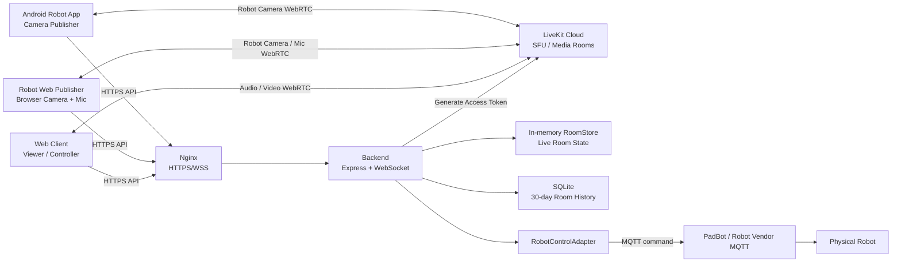
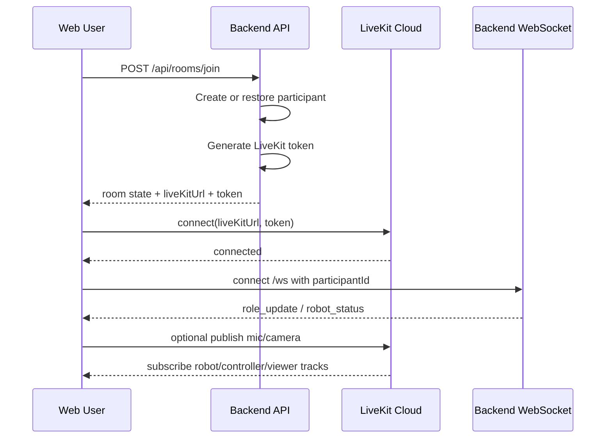
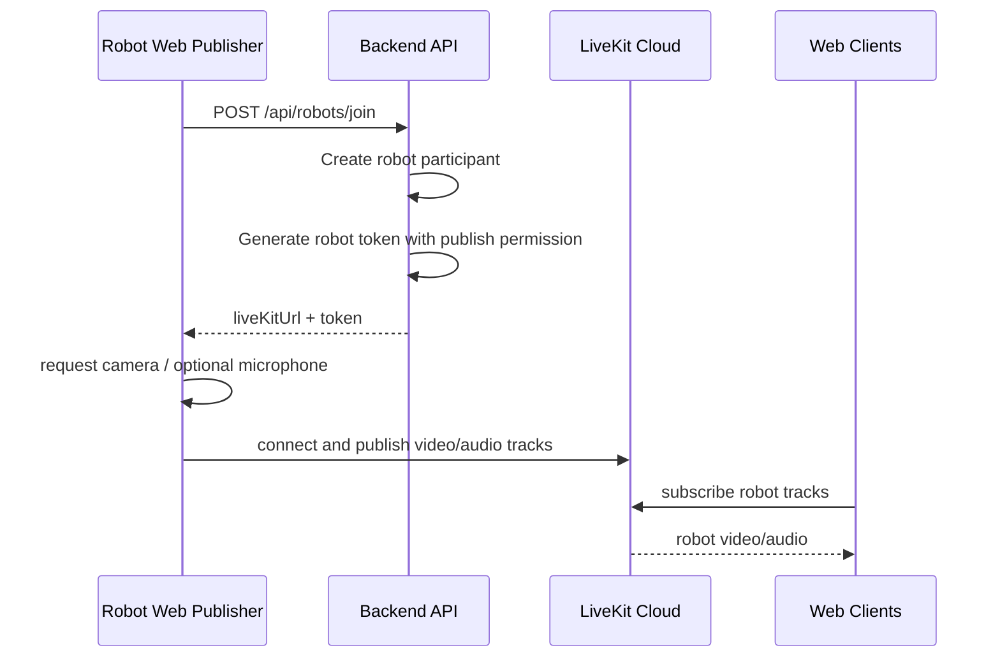
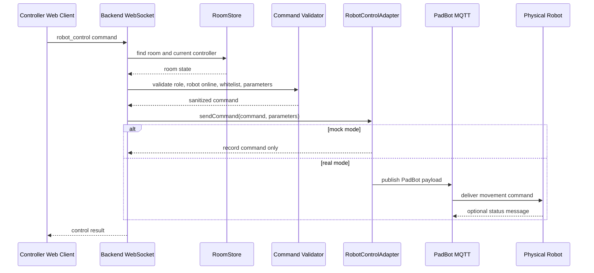
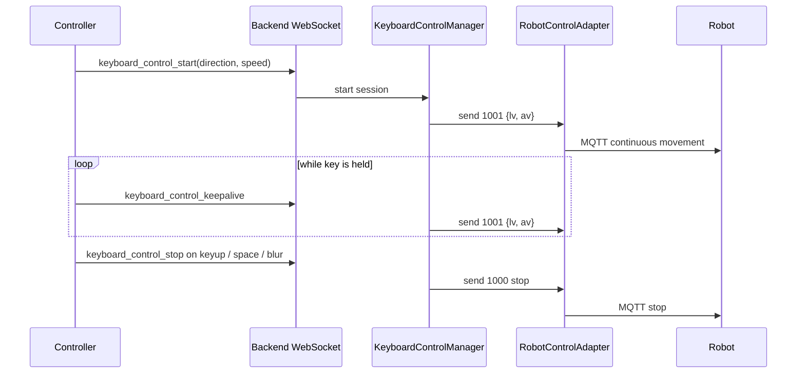
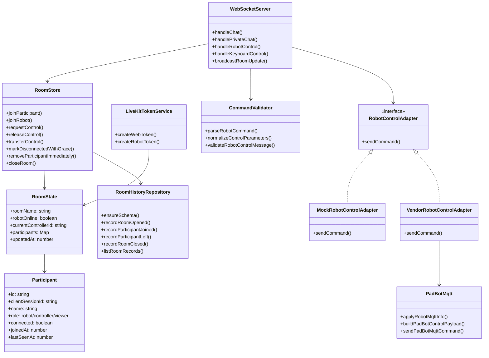
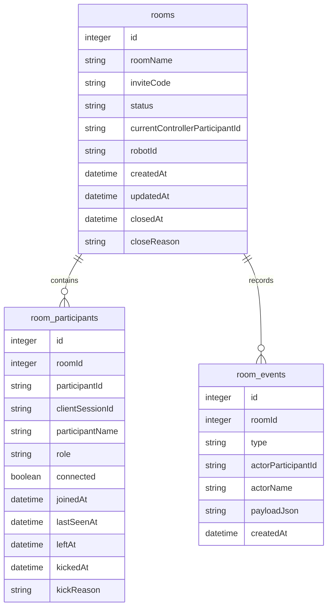

# LiveKit Cloud Robot MVP - Meeting Summary and Diagrams

本文档用于组会讲解当前 `livekit_cloud_mvp` 的项目现况、底层原理和核心设计。图示使用英文，方便直接放进汇报材料。

## 1. 一句话项目总结

本项目是一个基于 LiveKit Cloud 的远程临场机器人 MVP：Web 用户进入同一个房间观看机器人摄像头、进行多人音视频和聊天，其中只有当前 controller 可以通过 backend 校验后发送机器人控制命令，机器人音视频走 LiveKit Cloud，业务状态和控制权限走 backend。

## 2. 当前完成现况

### 已完成

- LiveKit Cloud 方案独立目录：`livekit_cloud_mvp/`。
- Backend：
  - `GET /health`
  - `POST /api/rooms/join`
  - `POST /api/robots/join`
  - `POST /api/rooms/control/request`
  - `POST /api/rooms/control/release`
  - WebSocket `/ws`
  - LiveKit Cloud token 生成。
  - controller/viewer/robot 房间角色管理。
  - 公共聊天、viewer-to-viewer 私聊。
  - controller 权限转移。
  - admin console API。
  - SQLite 房间历史记录、participant 历史、room events。
  - PadBot MQTT 机器人控制适配层。
- Web client：
  - 加入/创建房间。
  - viewer/controller 角色 UI。
  - Robot video 主画面。
  - Participants 面板。
  - 公共聊天和私聊。
  - 本地静音某个 viewer 或 robot 音频。
  - controller 麦克风/摄像头。
  - controller 控制底盘和键盘连续控制。
  - `/admin` 管理后台。
- robot-web-publisher：
  - 作为 robot participant 加入 LiveKit Cloud room。
  - 发布浏览器摄像头模拟机器人画面。
  - 可发布 robot microphone。
  - 订阅 controller/viewer 视频。
  - controller 视频和音频优先展示/播放。
- Android robot：
  - 保留 Android 8.1 机器人端接入说明和实现方向。
  - Android 只从 backend 获取 LiveKit token，不保存 secret。

### 仍需现场验证或继续完善

- 真实 Android 机器人长期运行稳定性。
- 管理员历史记录在云端重启后的持久化路径和备份策略。
- 更正式的登录/权限系统。
- 操作审计、限流、异常报警。

## 3. 底层原理

项目有两条核心链路：

1. 音视频链路：
   - Web、robot-web-publisher、Android robot 都先向 backend 请求 LiveKit token。
   - backend 用 `LIVEKIT_API_KEY` 和 `LIVEKIT_API_SECRET` 生成短期 token。
   - 客户端拿 token 直接连接 LiveKit Cloud。
   - 音频和视频在客户端与 LiveKit Cloud 之间传输。
   - backend 不转发 raw audio/video frames。

2. 业务控制链路：
   - Web 用户通过 HTTP 加入房间、申请/释放控制权。
   - 聊天、私聊、角色更新、机器人状态通过 WebSocket `/ws`。
   - 机器人运动命令必须经过 backend 权限校验。
   - 只有当前 controller 可以发控制。
   - backend 校验 command whitelist 和参数范围后，调用 RobotControlAdapter。
   - mock 模式只记录日志。
   - real 模式通过 PadBot MQTT 向机器人厂商 MQTT topic 发布命令。

## 4. System Architecture Diagram

## 5. Use Case Diagram

```mermaid
flowchart TB
  Viewer["Actor: Viewer"]
  Controller["Actor: Controller"]
  Robot["Actor: Robot Publisher"]
  Admin["Actor: Admin"]

  Join["Join Room"]
  Watch["Watch Robot Video"]
  Media["Publish Mic / Camera"]
  Chat["Public Room Chat"]
  PrivateChat["Private Viewer Chat"]
  RequestControl["Request Controller Role"]
  Transfer["Transfer Control"]
  Move["Send Robot Movement Commands"]
  PublishRobot["Publish Robot Camera / Mic"]
  AdminRooms["View Active Rooms"]
  History["View 30-day Room History"]
  Kick["Kick Participant"]
  Close["Close Room"]

  Viewer --> Join
  Viewer --> Watch
  Viewer --> Media
  Viewer --> Chat
  Viewer --> PrivateChat
  Viewer --> RequestControl

  Controller --> Watch
  Controller --> Media
  Controller --> Chat
  Controller --> Transfer
  Controller --> Move

  Robot --> PublishRobot
  Robot --> Join

  Admin --> AdminRooms
  Admin --> History
  Admin --> Kick
  Admin --> Close
```

## 6. Room Join and Media Sequence

## 7. Robot Publisher Video Sequence

## 8. Robot Control Sequence

## 9. Keyboard Continuous Control Sequence

## 10. Class Diagram

## 11. Database ER Diagram

## 12. 可以在组会上这样讲

### 项目价值

这个 MVP 解决的是“多人远程临场控制机器人”的最小闭环：远程用户可以通过网页进入房间，看到机器人第一视角视频，进行聊天和会议式音视频，同时由一个 controller 安全地控制机器人。

### 为什么选择 LiveKit Cloud

LiveKit Cloud 负责复杂的 WebRTC/SFU/音视频传输，我们不用自建媒体服务器，也不用让 backend 转发视频帧。这样 backend 只需要处理业务逻辑：房间、角色、权限、token、聊天、控制和管理后台。

### 为什么控制必须经过 backend

机器人运动是敏感操作。前端不能直接持有机器人厂商 key/token，也不能直接连 MQTT。所有控制命令先到 backend，backend 校验：

- 用户是否在房间。
- 用户是否是当前 controller。
- robot 是否在线。
- command 是否在白名单。
- 参数是否安全。

校验后才会进入 `RobotControlAdapter`。

### 当前机器人控制协议

- `1000`：整机停止。
- `1001`：底盘连续运动，只允许键盘控制专用通道使用。
- `1002`：底盘指定距离运动。
- `1003`：底盘旋转指定角度。
- `1004/1005/1006`：头部控制已移除，普通 `robot_control` 默认拒绝。

`1007/1008/1009` 手臂控制目前不做。

### 当前最大风险

- WebSocket/Nginx/IPv6 配置会影响部分设备访问稳定性。
- SQLite 是 MVP 本地持久化方案，正式上线需要备份和迁移策略。
- 管理后台目前是 admin token，不是完整账号系统。

## 13. 推荐组会结尾

当前项目已经从最初的 Web + Backend mock，推进到真实 LiveKit Cloud 音视频链路、机器人 web publisher、多人会议、管理员后台、SQLite 历史记录和真实 PadBot MQTT 控制适配。下一步重点不是继续堆功能，而是做稳定性验收：真实机器人长时间运行、网络断线恢复、管理员操作审计、Nginx IPv4/IPv6 配置收敛，以及真实 Android robot app 的长期测试。
